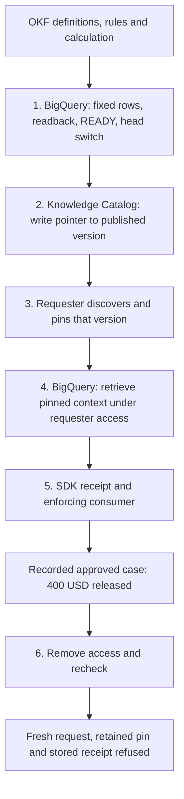
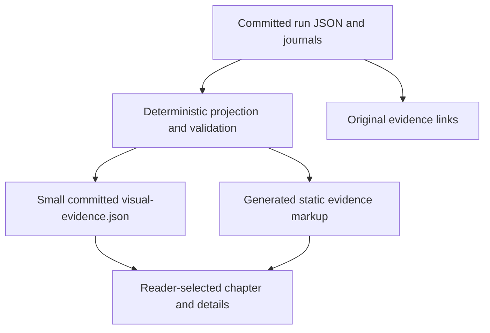

# Human visualization plan for /rfc/e2e/

## Goal Capsule

- **Objective:** A PM or BigQuery reader can explain, in about five minutes, how the agent's answer acquired an official knowledge version, permission checks, and execution evidence.
- **Means:** One six-stage visual walkthrough with a synchronized explanation panel, driven by retained live evidence (KTD1–KTD3).
- **Authority:** Haiyuan's visualization brief governs; retained run artifacts govern factual claims. This plan supersedes the CLI-first layout and video-led navigation in `rfc/e2e/plan.md` and `rfc/e2e/spec.md`; their evidence qualifications and site gates remain applicable.
- **Scope:** One site PR enhancing `/rfc/e2e/`. Opus implements; Astra and Kimi review. This document authorizes an implementation design, not a readiness claim or merge decision.
- **This phase ends:** Commit and push this plan only on `rfc/e2e-viz`; hand off to Opus. No page implementation, cloud run, or implementation PR in this phase.

---

## Product Contract

### Problem with the current CLI-first hero

The page has useful prose, but the primary demonstration still asks readers to decode a terminal recording, repeated stage lists, and technical verdicts. The relationship between a definition, BigQuery's published version, the Catalog pointer, and the released number is something readers must reconstruct. Captions improve the tape without making that relationship visible. A word-count pass alone did not solve this: the prior page review recorded 1,142 words, but no timed human study.

### Summary

Replace the primary demonstration with **Publish → Catalog → Discover → Retrieve → Receipt → Revoke**. Each selected stage highlights one concrete object or connection and answers two questions: “What does this mean for the reader?” and “What happened in BigQuery / Knowledge Catalog?” The source record is one click away. Keep all six short stage summaries visible so the whole argument survives a quick skim.

### Requirements

**Human story**

- R1. The primary path explains the problem, both product planes, the recorded outcome, and material limits in approximately five minutes without playing video or opening raw JSON.
- R2. The scenario explicitly bridges the RFC's **illustrative Alder 118% versus 96% retention slide** to the **live Acme January 2026 gross-margin checks on synthetic data**. The percentages are not BigQuery results from this run.
- R3. Explain the three benefits: replayable context, explainable access, verifiable execution. Open Knowledge Format (OKF) authors; Knowledge Catalog (KC) discovers; proposed BigQuery Knowledge Publish (BQ KP) publishes and serves. The enforcing consumer checks the SDK receipt before releasing a result.

**Evidence and honesty**

- R4. Every displayed run value and observed-state indicator comes from committed evidence or a deterministic JSON projection of it. A click selects historical evidence; it does not run or simulate a job.
- R5. Keep the exact recorded decisions, missing/not-run states, redactions, and limitations. The approved path and injected negative case are distinguishable. No blanket “all jobs succeeded” claim.
- R6. Preserve the CLI recording, captions, transcript, journals, report, and raw records under Evidence. Keep `/rfc/e2e/` and existing useful anchors working.

**Usability**

- R7. Keyboard, mobile, reduced-motion, no-JavaScript, and evidence-load failure paths remain understandable. Essential copy is not available only on hover or inside the video.

### Copy beats for a five-minute skim

These are proposed narrative copy, not replacement evidence values. The time allocations are a reading itinerary, never event timestamps or benchmarks.

| Reader time | Beat | Proposed copy / visual emphasis |
|---|---|---|
| 0:00–0:35 | Problem and bridge | **“Can you defend the agent's number?”** The RFC's Alder slide shows an illustrative 118% versus 96% retention disagreement. Here the same checks run on Acme gross margin: use the approved full-cost definition, check access, and verify the calculation. |
| 0:35–1:10 | 1. Publish in BigQuery | Finance's OKF files describe Gross Margin, its linked rules, and the approved calculation. The run writes and reads back a fixed knowledge version, marks it `READY`, then switches BigQuery's current-version pointer in one step. |
| 1:10–1:35 | 2. Write the Catalog pointer | Knowledge Catalog gets an entry pointing to the version BigQuery just published. It is the directory; BigQuery remains the serving authority. |
| 1:35–2:00 | 3. Discover as the requester | The agent's tool reads Knowledge Catalog using the requester's restricted account. The recorded pin identifies the same publication and dataset. Finding an entry does not grant access to its contents. |
| 2:00–2:35 | 4. Retrieve the fixed context | BigQuery returns the pinned definition and approved calculation with checked context. The requester's access applies. The current pointer is observed, not silently followed to another version. |
| 2:35–3:20 | 5. Check the receipt | The approved calculation produced **$400.00 USD**, released with a verified receipt in this run. A swapped query was refused. A separate hidden-rule test and an unreadable-dependency test stopped before receipt execution. |
| 3:20–3:55 | 6. Revoke and recheck | After access was removed and denial was observed repeatedly, a fresh request stopped at Catalog. A retained pin could not retrieve the knowledge; the stored receipt could not authorize another release. No new receipt execution launched. |
| 3:55–5:00 | Why better and limits | The three parts connect a declared definition to a fixed served version, current access checks, and evidence of the calculation. Shown once on synthetic data, using plain SQL and the SDK's own verifier. Graph-query access, an independent attester, new revisions, repeated runs and cost/latency remain open. |

### Why BQ KP + OKF + KC is better

Above the walkthrough, use one compact role line: **“OKF writes the knowledge · Knowledge Catalog helps find it · BigQuery publishes and serves the fixed version.”** Define “receipt” as the record checked before releasing the result. Name BigQuery Knowledge Publish as a proposed feature demonstrated with spike code.

Below it, replace the wide five-column comparison with three stacked question rows:

- **Which version and rules? — Replayable context.** Search ranks candidates; files describe knowledge. The combined path adds a validated publication and a Catalog pin to the version actually served by BigQuery.
- **Whose access, right now? — Explainable access.** Discovery permission alone does not explain retrieval permission. This run used the restricted requester's credential for discovery, retrieval and calculation checks, then checked refusal after revocation.
- **Did the approved calculation run? — Verifiable execution.** A declared calculation alone cannot establish execution. Here the consumer checked the SDK receipt connecting the job, calculation and result before release; substitution was refused.

Conclude: **“OKF alone supplies the declaration; Catalog alone supplies discovery; an ungoverned agent supplies neither this publication contract nor this receipt check. Together with BigQuery publishing and the enforcing consumer, the recorded path answered all three questions once.”** These are architectural comparisons from the RFC, not measured head-to-head product benchmarks or claims that Catalog has no IAM.

---

## Planning Contract

### Chosen approach and alternatives

- KTD1. **One reader-controlled stage timeline is the primary visualization.** Use six selectable chapters with persistent summaries and one detail panel. Readers can follow the whole flow or jump to the confusing handoff without waiting for playback.
- KTD2. **Pair each chapter with a small object diagram and plain-English panel.** Use a fixed publication card, a Catalog pointer card, a requester card, and a receipt/result card. This side panel is part of the same walkthrough, not a second demo.
- KTD3. **Generate a small committed evidence asset at PR/build time.** A deterministic local builder reads the pinned run files, checks joins, and emits `rfc/e2e/visual-evidence.json` plus generated static evidence-backed markup in `index.html`. This avoids downloading the large raw summaries for the primary experience and gives no-JS readers the same facts. No browser GCP credentials or cloud mutations.
- KTD4. **Keep media secondary.** Move the existing MP4 and chapter controls under Evidence. Preserve its caption track; do not drive the hero from WebVTT. Video compression and the absence of per-case completion timestamps make one shared “clock” misleading.

Rejected for this PR: a video-only replacement (still linear, harder to inspect), a second independently timed animation (two navigation systems and invented pacing), and a new screen-recorded browser walk (adds a recording to maintain without solving the primary reading path). Existing tape chapter markers remain useful inside Evidence. No bake-off is needed: these are reversible presentation choices with enough retained evidence to choose now.

### Information architecture and layout

1. **Compact hero:** headline, two-sentence Alder/Acme bridge, full product role line, and persistent “Recorded live run · synthetic data · one run · spike code” label. Primary link: **“Follow the six steps”**. Secondary link: “Inspect the evidence.” A short still-open line is visible before the walkthrough. No terminal image above it.
2. **Walkthrough (`#path`):** on desktop, a six-item numbered rail beside the stage workspace. Each rail item includes a verb and one-line meaning. Workspace contains a restrained object diagram above a panel with “What this means,” “Recorded in BigQuery / Knowledge Catalog,” and a closed “Source details” disclosure. Stage 1 is initially selected. Use `#stage-publish`, `#stage-catalog`, `#stage-discover`, `#stage-retrieve`, `#stage-receipt`, `#stage-revoke`.
3. **Two planes stay labeled:** teal for “OKF + Knowledge Catalog — authoring and discovery”; blue for “BigQuery Knowledge Publish — serving authority.” Requester/receipt use the existing purple. Colors supplement words and icons, never encode outcome alone. Do not draw Catalog as approving or serving the publication.
4. **Recorded outcome strip:** near the walkthrough, show the released amount with “Recorded approved case”; show the separate refused checks, and label the last state “Access removed; later release refused.” The amount is never presented as currently authorized after revocation. Values are generated from the case records.
5. **Why the parts work together (`#why`):** the three compact comparison rows above, followed by “Shown once / Still open” (`#proved`). Keep the substantive residuals visible in short form; detailed qualifications go in Evidence.
6. **Evidence (`#evidence`, closed):** run identity and UTC window; source manifest; publication/READY/head; Catalog pin; case decisions and scoped job inventories; technical limits; original CLI tape (`#tape` and `#tape-video`), captions, cast/transcript, report and raw records. Opening a deep link to `#tape` must open the enclosing disclosure before scrolling or seeking.

At narrow widths the rail becomes six stacked chapter summaries and the selected workspace follows it in normal flow. Next/Previous controls near the panel avoid repeated travel. No horizontal timeline, nested scrolling panel, or phone comparison table. Use the existing `styles.css` typography and color tokens, body text at least 16px, clear focus outlines, and wrapping evidence IDs.

### High-level design

The diagram describes the recorded flow; it is not a new live service architecture.

The site data flow is separate:

### Evidence binding: canonical inputs

All paths below are repository-relative. Aliases are only shorthand in this document:

- `R` = `rfc/spikes/bq-graph/evidence/publish-connected/kp-20260915t082018z-0387/`
- `P` = `R/publish_connected_live.json`
- `PJ` = `R/publish/journal.jsonl`
- `C` = `R/connected/e2e-20260915t082049z-34e6ed72/connected_live.json`
- `CJ` = `R/connected/e2e-20260915t082049z-34e6ed72/journal.jsonl`
- Report = `rfc/spikes/bq-graph/evidence/report-publish-connected.md`

The shorter `R/connected/connected_live.json` currently has identical bytes to `C`. Read the invocation-specific `C` as canonical; do not read a mutable “latest” run alias. Preserve the report and all originals.

Notation: `case(name)` means the unique element of **the array** `C.cases` whose `.case` equals `name`; it does not mean a keyed object. `A` = `case(connected-approved)`, `V` = `case(connected-revocation)`. Every selector in the table is an existing source field. Source details link to the raw file and print its exact JSON Pointer, or journal event/sequence plus physical line number, so a reader can reproduce the lookup.

| UI stage | Exact evidence selectors and required relationships | What can light / appear |
|---|---|---|
| Global identity | `P.run_id`, `P.mode`, `P.verdict`, `P.started_at`, `P.finished_at`; `P.connected.run_id = C.run_id`; `C.mode`, `C.engine`; `P.checks`; `A.catalog.pin.runtime_project` and job `.project` fields | Recorded run `kp-20260915t082018z-0387`, verdict `E2E_PUBLISH_CONNECTED`, project `test-project-0728-467323`, UTC window 08:20:18–08:32:49. `mode=live` describes the recorded invocation, not the viewer session. |
| 1a. Author / stage | `P.author.{ok,bundle_clean,checkout_head_matches_pin,projection_valid,source_pin,publication_id,nodes,edges}`; `P.state_trace[]` with `state=PLANNED`, `PREPARING`, `BQ_STAGED`, using each `.at` and `.jobs` | OKF source compiled; 44 nodes, 109 edges. Show a conceptual “definition + linked rules + calculation” bundle, not a fabricated graph of all rows. |
| 1b. Readback / READY | `P.publish.ready.state`; `.row.{validation_status,publication_id,ready_at,node_count,edge_count,section_count,source_pin}`; `.readback.{dangling,distinct,edge_rows,edges_sha256,node_rows,nodes_sha256,section_hashes}`; `PJ[event=publish]` corroborates `.state`, `.row`, `.readback`; `P.publish.jobs[]` roles `load_nodes`, `load_edges`, `readback_nodes`, `readback_edges`, `insert_publication`, `publication_status` | “Rows checked → READY” only when the seven readback checks are true and statuses agree. Counts 44 / 109 / 22 are node / edge / section counts, not customer or source-file counts. |
| 1c. Current head | `P.publish.head.{from,to,observed,state,merge_job_id,merge_state}`; `P.state_trace[state=BQ_COMMITTED].{at,head_from,head_to,merge_job_id,jobs}`; `PJ[event=head_switch]`; `P.publish.jobs[role=merge_head]` and the corresponding post-merge `read_head` | “No current version → published version” in the owned dataset: `from=null`, `to=observed=pub_190192147fd7fd78`, `state=SWITCHED`, `merge_state=DONE`. Never draw an old version being replaced or a new knowledge revision. |
| 2. Catalog pointer | `P.publish.catalog_pin.{entry,publication_id,readback_status,authored_aspects_present}`; `P.state_trace[state=KC_APPLIED].{at,entry,jobs}`; `PJ[event=write_pin]`; `PJ[event=terminal,role=create_entry]` and `readback_entry` (`seq=22,23`, `terminal=true,state=DONE,error=null`) | Arrow **from the published BigQuery version to its Catalog pointer**, only after head switch and readback `OK`. These Catalog operations have `job_backed=false,job_id=null`: show operation/resource evidence, not an invented BQ job ID or HTTP response. |
| 3. Discover / pin | `C.caller.{status,caller_is_requester}`; `C.grant.catalog_before.{status,http_status}`, `.catalog_wait.{status,observed,waited_s}`, `.stable.stable`; `A.catalog.{status,mode,note,discovery,pin}`; `CJ[event=catalog_raw,name=connected-approved__catalog_list_0]` and `...__catalog_entry` with `.at`, `.raw_sha256`, `.retained_sha256`; `P.consumed.{status,checks,observed,dataset,publication_id,entry}` | “Requester read the directory; served version matches.” Denied before grant / allowed after; observed 71-second Catalog wait is diagnostic only. `P.consumed.status=MATCH` and all seven checks true corroborate the publication/dataset binding. |
| 4. Retrieve | `A.publication.{status,publication_id,checks,head}`; `A.retrieval.{status,reached,scope,paths,computations,timing.jobs}`; `A.payload.status=CONSISTENT`; `A.bind.status=BOUND`; `A.authorization.{status,at,denied}`; `C.journal.jobs[]` and `CJ` roles `pin_resolution`, `seed_visibility`, `observed_head`, `retrieval_walk`, `retrieval_context`, `retrieval_nodes`, `chain_declaration`, `payload_rows` | Pinned context and approved calculation returned, binding checked, access allowed. Job details use the approved case's referenced jobs; do not attach every job with the same role from other cases. `scope.engine=fallback`: any relation drawing is a conceptual view of SQL retrieval, not GQL execution. |
| 5. Receipt / release | `A.receipt.{invoked,live,exit_code,released}`; `.output.{verdict,execution_match,job}`; `.receipt.{verdict,execution_match,job,receipt_id,computation_digest,context_ref}`; `A.consume.{decision,display,reasons}`; `C.decisions`, `C.acceptance`; `P.connected.summary.{answer,receipt_verdict,cases}` | Receipt matches and consumer releases the recorded $400.00 only with source agreement. Copy the display value; if formatting removes `[LIVE]`, keep “Recorded live result” adjacent and retain the exact source string under details. Three separate refused-case chips use their own case records, as specified below. |
| 6. Revoke | `V.revocation.{observed,catalog,catalog_wait,requester,stable}`; `V.fresh_request.{catalog.status,downstream_ran,stopped_at}`; `V.bypass.publication.status`; `V.bypass.retrieval.{status,disclosed_anything}`; `V.authorization.status`; `V.consume.decision`; `V.receipt_invocations_after_revocation`; `V.cache`; `V.stored_receipt_note` | “Access removed; subsequent checks refused”: `stable.stable=true`, fresh `CATALOG_ERROR` with `downstream_ran=false`, bypass publication `ERROR`, retrieval `DENIED` with no disclosure, authorization `DENIED`, consume `REFUSED`, receipt invocations 0. Keep exact statuses in details. Retrieval-cache replay was not exercised. |
| Closing evidence, not seventh stage | `P.publish.cleanup.{status,pending,unresolved_jobs,steps}` with each step `.deleted` and `.absent_verified`; `P.publish.originals_recheck.status`; `C.teardown`; `P.connected.summary.teardown` | Run-owned entry/dataset deleted and absence checked; originals `UNCHANGED`. Do not imply the deleted resources still serve queries today. `P.state_trace[state=COMPLETE]` is publication-phase completion at 08:20:47, not end-to-end completion or cleanup at 08:32:49. |

### Concrete identity and decision anchors

The builder must retain full `(project, location, job_id)` references; shortened labels are display-only. Examples below are copied from the run, never templates to synthesize more IDs:

- Head MERGE: `okf_cc_kp_20260915t082018z_0387_merge_head_b402d3731b67`, `US`, `test-project-0728-467323`.
- Approved retrieval walk: `okf_cc_e2e-20260915t082049z-34e6ed72_retrieval_walk_7f2f49791577`, same project/location; bind from `A.retrieval.timing.jobs[stage=walk]`.
- Approved receipt job: `okf_rcpt_a783c736b3ac936351bef069_22e00a1dd6cb4fc8` from `A.receipt.output.job` and `.receipt.job`.
- Substitution job: `okf_rcpt_d2472cd6fef3b214eb39c20d_2a2706019e808fcb` from `case(connected-sql-substitution).receipt.receipt.job`; its `.receipt.output.job` is **null**, so do not substitute the approved job there.
- Catalog entry: `projects/test-project-0728-467323/locations/us-central1/entryGroups/okf-rfc-demo/entries/acme-retail-kp-publish/kp-20260915t082018z-0387/metrics/gross-margin` from `P.publish.catalog_pin.entry`. Some consumer records mask its suffix; preserve that redaction and use `P.consumed.checks.entry_is_owned` to corroborate ownership rather than reverse-engineering masked IDs.
- Publication `pub_190192147fd7fd78`; owned dataset `okf_kp_publish_kp_20260915t082018z_0387`. Join `P.author.publication_id`, `P.publish.ready.row.publication_id`, `P.publish.head.to`, `P.publish.catalog_pin.publication_id`, `A.catalog.pin.publication_id`, `A.publication.publication_id`, `A.retrieval.scope.publication_id`, and `P.consumed.publication_id`; likewise join the owned, publish, pin, and consumed dataset fields.

**Do not equate the SDK receipt's publication ID with the graph publication ID.** The receipt uses `okf-receipt-spike/acme-retail-derived/gross-margin-period`. `A.bind.{sdk_publication_id,sdk_context_ref,computation_digest,checks}` records that binding; its source-pin note is a compared lineage label, not a Git attestation.

The Receipt panel shows three short **recorded negative checks**, not three new buttons that pretend to execute a case:

- **Swapped query:** `case(connected-sql-substitution).receipt.output.{verdict,execution_match,reason_codes}` = `REJECTED`, `MISMATCH`, `[sql_mismatch]`; consume `REFUSED`. A receipt job did run.
- **Hidden rule:** `case(connected-denied-intermediate).retrieval.{status,reached}` = `OK`, `false`; `.bind.status=NOT_REACHED`, `.authorization.status=NOT_RUN`, `.receipt.invoked=false`, consume `REFUSED`. Label **“Separate injected legacy-seed test on the governance copy”** beside this check, not only in the bottom evidence fold.
- **Unreadable dependencies:** `case(connected-unauthorized-output).authorization.{status,denied}` = `DENIED`, `7`; `.receipt.invoked=false`, consume `REFUSED`. Do not portray this as a failed calculation or seven failed receipt jobs.

Inventory totals stay scoped: `P.publish.author_identity` records **19 author jobs BOUND**; `C.identity.roles` records graph 46, policy_admin 9, receipt 2, requester_probe 1. Policy-admin jobs ran as operator. `C.job_inventory.graph_and_store`, `.receipt`, `.unresolved` retain the inventory; `C.journal.jobs` retains job details. No claim that all 58 consumer-side jobs ran as the requester or all were successful.

For case-specific job chips, use direct references in that case's `retrieval.timing.jobs` and receipt objects. Additional store/declaration/payload jobs remain in the run-level inventory unless an explicit source reference establishes their case membership; role names alone cannot establish that membership.

### Projection and validation rules

The proposed builder `rfc/tools/build_e2e_visual_evidence.mjs` uses only committed inputs. It emits an allowlisted, versioned JSON shape: source paths and computed SHA-256 digests; recorded run identity/labels; stage facts and result states; selected case facts; job/operation references; source references for every fact. Human narrative and chapter order are editorial fields, visibly distinct from observed facts. No code in this plan is an implementation.

Validation must:

1. Require both pinned run IDs, live modes, expected verdicts and cross-file agreement. Require the named checks and exact case set; never use vacuous “all present values are true” tests when required fields are missing.
2. Parse JSONL with physical line numbers. Match lifecycle records by the owning journal plus sequence and complete job reference, preserving append order. Count a job once, not once per intended/submitted/terminal event.
3. Use final resolved journal state. `CJ` contains two `UNKNOWN` observations later reconciled to terminal **ERROR** for the revoked bypass (`seq=45,46`). Preserve those errors as evidence of refusal; server `observed=DONE` does not turn them into successful queries. Join to `C.journal.jobs`; do not discard reconciliation events.
4. Keep Catalog API operations separate from BQ jobs. `catalog_raw.raw_sha256` hashes the original response; `retained_sha256` hashes its redacted copy. Do not hash the redacted file and claim it matches the original hash. Do not synthesize missing HTTP statuses, response bodies, source titles, or timestamps.
5. Generate timestamps only from recorded fields: `state_trace[].at`, journal `terminal_at` / `reconciled_at`, `catalog_raw.at`, authorization `.at`, and receipt issue time where appropriate. Cases lack a universal completion timestamp; label a case outcome “Recorded outcome” without inventing one. Stage spacing is ordinal, not proportional to elapsed time.
6. Escape values as text. Preserve masked IDs and nulls. Never expose historical local `path`, `argv`, credential filenames or environment fields in the new UI; resolve source links from the explicit repo-relative allowlist instead. Do not fabricate a customer dataset or graph edge to make the picture fuller.
7. Provide `--check` mode that recomputes JSON and generated markup and fails on stale bytes. A missing or contradictory source prevents generating an observed-success state; do not fall back to canned success data.

### Interaction and animation

- Initial view shows six chapters and the first stage detail, already backed by the recorded evidence. A selected outline means **“You are reading this stage.”** A separate labeled outcome means **“This was observed in the recorded run.”** Unselected stages mean unselected, not pending cloud work.
- Selecting a chapter highlights its object and relevant connector and replaces the explanation. A short 150–200 ms opacity/outline transition is enough. No autoplay, percent progress, spinner, typewriter logs, animated job counter, or fabricated wait.
- Within Publish, render the four recorded checkpoints together: write → readback → READY → head switched. Within Receipt and Revoke, clearly separate released / refused / not executed. Expected refusal uses a stop icon and the word “Refused,” not a generic success tick or app-error treatment.
- Previous/Next and chapter anchors support keyboard and direct links; announce the selected heading politely. Evidence disclosures stay independently usable and do not auto-scroll the reader.
- Reduced motion removes transitions. With JavaScript disabled, generated stage articles remain visible in order. If enhancement data fails to load, preserve that explicitly dated static record, show “Interactive details unavailable” and raw links; never promote generic fallback text to a verified result. If there is no valid generated record, show evidence unavailable and no success badges.
- “Watch this in the original CLI recording” opens the Evidence fold and seeks the existing tape. Preserve existing verified chapter offsets from `rfc/e2e/plan.md` / VTT (e.g. publish 11.7s, Catalog 27.4s, discover/retrieve 39.8s, receipt 48.8s, revoke 69.8s). These are compressed recording positions, not live-run elapsed times. Video playback highlights its own chapters only; it does not take control of the primary walkthrough.

### What moves, limits, and non-goals

- The terminal poster, MP4, caption track, tape chapters, and long ID tables move into Evidence. Reuse `../demo/okf-publish-connected.mp4` from the page; do not duplicate or regenerate its bytes.
- The seven-step prose list becomes six visual chapters: Author folds into Publish; Catalog creation and requester discovery become separate chapters; cleanup becomes a closing evidence note. The current wide comparison becomes the three short outcome rows.
- Narrow the prior “agent receives no IDs” copy if retained: the final answer is clean, while the tool payload includes run IDs and a masked receipt reference. Prefer describing the **final answer**, not promising an ID-free tool input; make the matching small VTT wording correction without changing timing.
- Preserve residuals: plain relational SQL, not GQL; SDK verifier with requester-held key, no independent attester; fresh deployment of the same content-addressed publication, not a new knowledge revision; simplified §05 with no `sync_id`, `deployment_heads`, `*_current` views or Catalog lag SLO; harness-managed access; injected `_rls` negative; retrieval cache not exercised; n=1 synthetic data; no cost/latency benchmark. Earlier `E2E_BROKEN` evidence stays broken.
- No backend, browser execution controls, IAM changes, live-query dashboard, fake Catalog console, graph editor, new product workflow, customer-data claim, or broader RFC redesign. No “ready for production” or general readiness language.
- **New live run: not needed.** Retained evidence is sufficient. A future new run would be a separately scoped operation, not a prerequisite to this site PR. A new browser video is deferred.

---

## Implementation Units

### U1. Bind the recorded evidence

**Goal / requirements:** Build the factual foundation for R4–R5, following KTD3.

**Files:** new `rfc/tools/build_e2e_visual_evidence.mjs`, `rfc/tools/build_e2e_visual_evidence.test.mjs`, `rfc/e2e/visual-evidence.json`; generated markup region in `rfc/e2e/index.html`.

**Approach:** Read the canonical inputs, validate the relationships above, and emit the allowlisted projection and static record. Follow the repo's deterministic generator / `--check` pattern in `tools/site_nav.mjs`; use the existing Node test convention. No new framework or package required.

**Verification scenarios:** The retained files produce all six correctly sourced chapters; removing a required READY check or changing the pin dataset prevents success generation; changing a verdict prevents the $400 release; duplicate case names fail; `UNKNOWN → reconciled ERROR` stays refusal evidence; missing receipt job remains null; HTML-looking masked text is escaped; changing generated values or source bytes makes `--check` fail. Use temporary mutated copies for parser checks only, never present them as live evidence.

### U2. Build the human walkthrough and move the tape

**Goal / requirements:** Deliver R1–R3 and R6–R7 using U1 and KTD1–KTD4.

**Files:** `rfc/e2e/index.html`, `rfc/e2e/styles.css`, new `rfc/e2e/visual-walkthrough.js`, new `rfc/tools/check_e2e_visual.mjs`; small correction in `rfc/e2e/okf-publish-connected.en.vtt` if its output-hygiene sentence remains.

**Approach:** Keep the site navigation and route intact. Build the layout, semantic chapter anchors, conceptual object diagram and source disclosures; progressively enhance the generated static content. Move tape controls into Evidence and preserve deep links. Use the existing typography/tokens and existing browser-check conventions from `tools/check_site_nav.mjs`.

**Verification scenarios:** All chapter clicks, direct links and Previous/Next show the right facts; rewind/jump does not imply execution; no-JS and data-fetch failure preserve honest content; keyboard and reduced motion work; `#tape` opens its fold; compressed-time seeking works with an HTTP Range-capable local server; desktop and phone views have no page overflow or hidden essential text.

### U3. Verify reading, evidence fidelity, and handoff

**Goal / requirements:** Demonstrate the four P1 gates below after U1–U2.

**Files:** `rfc/e2e/intent.md`, `rfc/e2e/spec.md`, `rfc/e2e/plan.md` receive concise supersession/updated-check notes in the implementation PR; browser acceptance script above; review evidence outside the shipped page.

**Approach:** Keep one cohesive site PR. Include screenshots, measurements, source-check results and residuals in the review handoff. Do not label estimated reading time as a completed human test.

**Verification:** Run the contract below. Opus opens the implementation PR only after presenting a concrete reviewable page. Astra and Kimi perform the subsequent reviews; this plan verdict does not replace them.

---

## Verification Contract

### Acceptance checklist for Opus

Every P1 item is a blocking review gate, not an aspirational score.

- [ ] **P1 — Five-minute understandability (R1, R7):** First viewport at 1280×800 establishes the problem, scenario bridge, both planes and recorded-run label, and exposes the walkthrough start; at 390×844 these occur within the first short scroll. The complete primary reading path, including all six selected panels once, visible diagram labels and comparison/residual copy, targets **850 words, with a 950-word cap**, plus about 45 seconds to inspect/operate it. Count CSS-generated visible labels; exclude clipped accessibility-only duplicates. Do not pass by counting only the initially selected panel. Existing skim tooling is a smoke check, not sufficient proof of dynamic reading load.
- [ ] **P1 — Reader check:** Have a PM/BQ reader unfamiliar with the implementation spend at most five minutes on the primary path without the tape or raw records. They can state (1) the problem, (2) which system decides the served version, (3) what the Catalog pin does, (4) why $400 was released and later checks refused, and (5) one material limit. Retain elapsed time and their answers. If a human reader is unavailable, report this gate **unverified** and provide the timed reviewer walkthrough plus word count as proxies for Astra's explicit adjudication; never manufacture a pass.
- [ ] **P1 — Why-better thesis (R3):** The three RFC outcomes and limitations of ungoverned / OKF-only / Catalog-only paths are explicit. BigQuery is the serving authority; Catalog is the directory; the consumer's SDK receipt check is part of the explanation. No unsupported exclusive product claim.
- [ ] **P1 — Realness (R4–R6):** The pinned files, exact field bindings, source digests and journal joins validate. Each observed state has an inspectable source. Both live run IDs, exact verdict, publication, dataset, MERGE and receipt jobs agree. Catalog operations carry operation evidence instead of invented jobs. No hardcoded fallback success or browser-side cloud execution.
- [ ] **P1 — Scenario fidelity (R2):** Alder 118%/96% is labeled illustrative beside the numbers. Acme is January 2026 gross margin on synthetic data with recorded $400.00 USD. The live approved path and the injected `_rls` negative are visibly distinct. No made-up wrong Acme amount, Alder query, customer result, or graph execution.
- [ ] **P1 — Honest failure / limits (R5):** Revocation distinguishes fresh request, retained-pin bypass and stored-receipt redecision; cache replay is not claimed. Refused and not-executed outcomes retain their meaning. The publication-phase `COMPLETE` is not used as an end-to-end success event. The SDK-vs-graph publication-ID distinction and all named residuals survive the rewrite. No readiness claim.
- [ ] Keyboard focus, chapter navigation, reduced motion, no-JS, fetch failure, 200% zoom, 1280px desktop and 390/375px phone views pass; diagrams have readable text equivalents, status words and non-color cues.
- [ ] Evidence/tape deep links, relative sources, media/caption downloads and existing route anchors work. Opening Evidence does not block the primary reading flow. No asset values are unescaped HTML, and no local machine path appears as a site link.
- [ ] The implementation diff is site-only; original evidence, MP4, cast and transcript bytes remain unchanged. No cloud calls, PR merge or deployment is bundled into implementation validation.

### Checks to record with the implementation PR

Run these during implementation, not during this plan-only phase:

- New evidence generator `--check` and `node --test rfc/tools/build_e2e_visual_evidence.test.mjs`.
- New `node rfc/tools/check_e2e_visual.mjs` with full chapter traversal and reading-load measurement.
- `node tools/site_nav.mjs --check` and `node tools/check_site_nav.mjs`.
- `node rfc/tools/check_rfc_routes.mjs`.
- Existing `node rfc/tools/rfc_skim_check.mjs rfc/e2e/index.html --max-rendered 950 --window 350 --tokens "Open Knowledge Format,Knowledge Catalog,BigQuery Knowledge Publish,synthetic,still open"`; supplement with the dynamic path count above.
- Relative-link and caption-track checks; visually inspect desktop/phone screenshots rather than inferring quality from DOM counts. Use a Range-capable local server for video seeks, as established in the prior page review.

---

## Definition of Done

The implementation delivers one evidence-bound human walkthrough, preserves the original evidence path, and presents all P1 results for review with no hidden gaps. Any unavailable human reading check is explicitly adjudicated by Astra before claiming that gate passed. Opus can implement the chosen design without another design-choice round; exact CSS breakpoints and internal helper names are implementation details. No new live run or additional media is required.

This plan approves the **design for implementation only**. The current page has not been rewritten or revalidated by this planning task.
