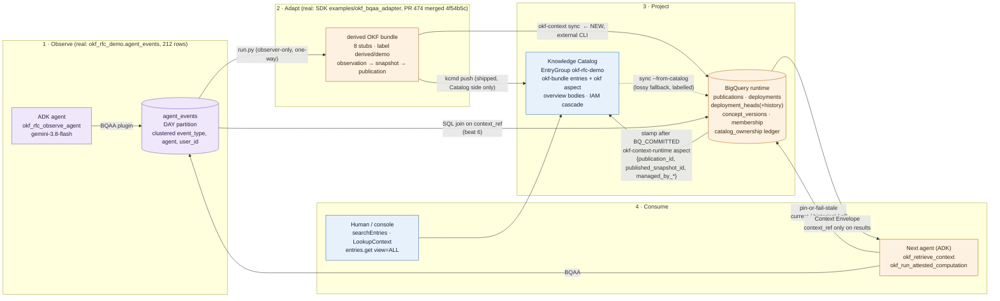

# Architecture — KC → BQ sync recommendation and the Observe → Adapt → Project → Consume flow

Recommendation: **hybrid (option C)**. Knowledge Catalog is the distribution and discovery
projection written by `kcmd push`. BigQuery is the serving authority. The sync leg is an
**external CLI** (`okf-context sync`) in v1, scheduled or CI-triggered in production, with an
honest path to a managed job later. Decisions and evidence are in `spec.md` §1.

## One diagram

Colour key matches the RFC tokens: telemetry (purple), catalog (blue), runtime (amber).

## The sync leg, step by step

| Step | Actor | Writes | State after |
|---|---|---|---|
| validate · observe · snapshot | `okf-context sync` (local) | nothing | identities computed |
| plan | CLI | nothing | diff vs `deployment_heads` printed; absence = delete |
| commit | CLI → BigQuery | staged rows under `sync_id`, then `publications`, `deployment_heads`, `deployment_heads_history`, ledger | `BQ_COMMITTED` |
| stamp | CLI → Knowledge Catalog | `okf-context-runtime` aspect on owned entries; delete ledger-owned entries for removed concepts | `CATALOG_STAMPED` (or `CATALOG_PENDING` on partial failure; rerun completes without a new publication) |
| status | CLI | nothing | lag = publications committed − publications stamped |

Trigger options, in order of what the demo shows: manual CLI (demo), Cloud Run Job on Cloud
Scheduler polling the EntryGroup `updateTime` (production default), CI step after `kcmd push`.

## Why not a built-in service, and what "managed" would need

- BigQuery cannot read Catalog entries or custom aspects (no connector, no INFORMATION_SCHEMA view).
- Dataplex cannot materialize an EntryGroup into a dataset and does not own the profile's hashing
  rules, republish semantics, or `deployment_heads`.
- No cross-service transaction exists, so explicit `BQ_COMMITTED` / `CATALOG_STAMPED` states are
  required either way; a managed job would still expose them.
- A managed version would be: the same CLI packaged as a Dataplex-triggered job, with the
  `okf-context-runtime` aspect template owned by the service, and the ledger held in a
  service-managed dataset. If Dataplex metadata export jobs cover custom aspects, the read leg of
  `sync --from-catalog` could become a BigQuery load from that export; this is **UNVERIFIED** and
  not part of v1.

## What the two stores are each allowed to answer

| Question | Catalog | BigQuery |
|---|---|---|
| Does concept X exist, who owns it, what does it say? | yes | yes |
| Which publication is current for deployment D? | display only (stamped pin) | authoritative |
| What was current at time t? | no | `deployment_heads_history` |
| Is this `context_ref` stale? | no | pin-or-fail-stale |
| Was the number attested? | no | `verdict` + `receipt_id` |
| Which sessions used which publication? | no | SQL join to `agent_events` |
| Who may read the policy body? | EntryGroup IAM (coarse) | caller-delegated per deployment |
