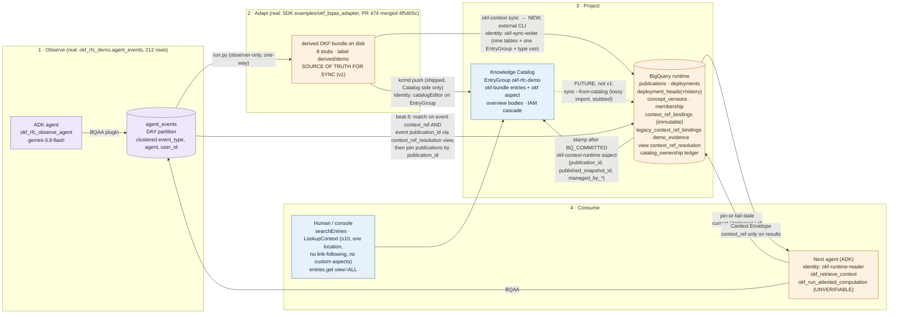

# Architecture — bundle → BigQuery commit → Catalog stamp (v1 sync) and the Observe → Adapt → Project → Consume flow

Recommendation: **hybrid (option C), external CLI in v1**. Knowledge Catalog is the distribution
and discovery projection written by `kcmd push`. BigQuery is the serving authority. The sync leg is
`okf-context sync`, an external CLI whose v1 direction is **bundle → BigQuery commit → Catalog
stamp**. The only place the words "Catalog → BigQuery" apply is the future importer
(`sync --from-catalog`), which is lossy, stubbed, and not v1. Decisions, evidence, and the IAM contract are in `spec.md` §1.

## One diagram

Colour key matches the RFC tokens: telemetry (purple), catalog (blue), runtime (amber).

## The sync leg, step by step

| Step | Actor / identity | Writes | State after |
|---|---|---|---|
| validate · observe · snapshot | `okf-context sync` as `okf-sync-writer-<deployment>` | nothing | identities computed |
| plan | same | nothing | diff vs `deployment_heads` printed; absence = delete |
| commit | same → BigQuery (table-level `dataEditor` on the nine runtime tables; no dataset grant) | staged rows under `sync_id`, then `publications`, `deployment_heads`, `deployment_heads_history`, `context_ref_bindings` (append-only, one ref → one publication, never rebound), ledger | `BQ_COMMITTED` |
| stamp | same → Knowledge Catalog (`catalogEditor` on the one EntryGroup) | `okf-context-runtime` aspect on owned entries; delete ledger-owned entries for removed concepts | `CATALOG_STAMPED` (or `CATALOG_PENDING` on partial failure; rerun completes without a new publication) |
| status | same | nothing | lag = publications committed − publications stamped |

Status on 2026-09-03 (PR 16): none of this section has run. The sync leg, the service accounts, the
grants and the checks below are the Phase A contract, `RFC text only` on the page. What PR 16 did run,
as the operator, is the shipped sample (`setup.ts` + `push.ts`, Catalog side only) and the runtime
DDL + seeds; see `spec.md` §1.2 for the row-by-row status.

In Phase A a human bootstrap operator (the project Owner) will hold time-boxed policy-owner roles, create
the service accounts and the custom search role, and make every binding on tape (Phase A, not yet run). Setup (`okf-setup`,
one-time, project-level type and group creation) will create the tables, the `context_ref_resolution`
view and the seed rows (`sql/setup_runtime_tables.sql`), the `okf-context-runtime` AspectType, and
run the sample `setup.ts` for the shipped `okf-bundle` / `okf` types; afterwards every `okf-setup`
role and its impersonation grant must be revoked and two denial checks must show it. The sync writer will
additionally hold `entryTypeUser` on `okf-bundle` and `aspectTypeUser` on `okf` and `okf-context-runtime`.
Readers (`okf-runtime-reader`) will hold `dataViewer` on the dataset, `catalogViewer` on the EntryGroup,
and a custom role with only `dataplex.projects.search` at project level for `searchEntries`. Positive and
negative permission checks, including the boundary-probe EntryGroup, are specified in `spec.md` §1.3.

Trigger options, in the order the demo would show them: manual CLI (the Phase A tape; not yet recorded),
Cloud Run Job on Cloud Scheduler polling the EntryGroup `updateTime` (production default), CI step after
`kcmd push`.

## Why not a built-in service, and what "managed" would need

- BigQuery cannot read Catalog entries or custom aspects (no connector, no INFORMATION_SCHEMA view).
- Dataplex cannot materialize an EntryGroup into a dataset and does not own the profile's hashing
  rules, republish semantics, or `deployment_heads`.
- No cross-service transaction exists, so explicit `BQ_COMMITTED` / `CATALOG_STAMPED` states are
  required either way; a managed job would still expose them.
- A managed version would be: the same CLI packaged as a Dataplex-triggered job, with the
  `okf-context-runtime` aspect template owned by the service, and the ledger held in a
  service-managed dataset. If Dataplex metadata export jobs cover custom aspects, the read leg of a
  future `sync --from-catalog` could become a BigQuery load from that export; this is **UNVERIFIED**
  and not part of v1. No Dataplex roadmap item is claimed.

## What the two stores are each allowed to answer

Status on 2026-09-03 (PR 16): rows that say a beat show a live query or capture on that beat; the
syncer has not run, so `deployment_heads` and its history are empty, `FAIL_STALE` is **not yet
shown** (only `FAIL_CLOSED`, `NO_HEAD`, `AMBIGUOUS_LEGACY`), and the stamped pin does not exist.

| Question | Catalog | BigQuery | Demo status |
|---|---|---|---|
| Does concept X exist, who owns it, what does it say? | yes | yes | beat 3 / 5 |
| Which publication is current for deployment D? | display only (stamped pin, `entries.get view=ALL`) | authoritative (`deployment_heads`) | beat 3 / 5 (pin not yet stamped; heads empty) |
| Which publication was current at time t? | no | `deployment_heads_history` | beat 5 (query runs; 0 rows until a sync commits) |
| What was the number at time t? | no | future executor/attester | `RFC text only` |
| Is this `context_ref` stale? | no | pin-or-fail-stale | beat 5 for `FAIL_CLOSED` / `NO_HEAD`; `FAIL_STALE` not yet shown, `RFC text only` |
| Was the number attested? | no | `verdict` + `receipt_id` (always `UNVERIFIABLE` in demo) | beat 5 |
| Which sessions used which publication? | no | two-key match through the `context_ref_resolution` view, then `publications` by id | beat 6 |
| Who may read the policy body? | EntryGroup IAM (coarse, real) | caller-delegated per deployment | `RFC text only` |
