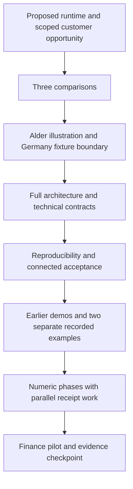

# Full RFC alignment and human tone - Plan

## Goal Capsule

- **Objective:** A full-RFC reader understands the scoped customer opportunity, the recorded evidence and the remaining connected-product requirements in clear prose, with the complete design available underneath.
- **Means:** Revise existing sections using the [content map](full-rfc-align-content-map.md), preserving the [spec's contracts and protected bytes](full-rfc-align-spec.md) (KTD1–KTD5).
- **Authority:** Haiyuan's task, the supplied joint position and updated experiment status, pinned evidence, merged board-pack tone, then the preserved main-RFC design. Source precedence is specified in the spec.
- **Execution:** Astra commits and pushes the four planning artifacts on `feat/full-rfc-align-human`. Fable implements the HTML in the next pass. This packet grants no PR, merge, deployment or cloud-experiment authority; Haiyuan remains merge gate.
- **Stop condition for planning:** Both file sets match, only the four planning files are committed, push is confirmed remotely, and a vault learning/context note exists. No background work remains necessary to finish the push.

---

## Product Contract

### Summary

Align `rfc/index.html` with the recorded receipt and graph examples and their limits. Replace skim score labels with explanations of what works and what remains to prove. Keep the full argument and proposed design behind `rfc/board-pack/`.

### Problem Frame

The baseline already contains the Alder story and detailed runtime design. Its early assessment predates the recorded examples, its first-workload claim omits the capacity distinction, and its receipt identity prose leaves authoritative result binding unresolved. The optional-Graph statements also conflict with an unconditional Phase 5 equivalence gate. Repeating the earlier rewrite would add duplication and could erase important design detail.

### Requirements

Canonical requirements and acceptance examples live in [the spec](full-rfc-align-spec.md): R1–R5 define scope/story, R6–R12 evidence and promotion, R13–R16 contract/presentation integrity. A1–A10 define document acceptance. All are in scope; none is satisfied by a runtime rerun in this task.

The user-supplied requirements are preserved. The result-evidence and optional-Graph clarifications expose existing inconsistencies without selecting a new security model, changing public schemas or rearranging the numeric phases.

### Scope

The baseline is `d3f66f437977d6fa18e695477c849d06444f7781` on `feat/full-rfc-align-human`. All implementation units target only `rfc/index.html`. The planning packet contains `full-rfc-align-intent.md`, `full-rfc-align-spec.md`, `full-rfc-align-plan.md`, and `full-rfc-align-content-map.md` under both `rfc/` and the requested `/tmp/okf-full-rfc/` EM directory.

Existing demo, full-demo, board-pack, redirect, experimental evidence and prior planning files are excluded from editing. Runtime development, new experiments, cloud resources, signature design and grants are follow-up work. They remain explicit gates in the prose, not unanswered questions for Fable's HTML implementation.

---

## Planning Contract

### Key Technical Decisions

- KTD1. **Revise in place and preserve depth.** Keep all numbered sections and anchors. Put the current assessment in the summary and supporting evidence inside the existing phases section. Move the summary's unique package mechanics into its existing technical baseline disclosure. This keeps the opening readable without losing the design (R2–R5, R14).
- KTD2. **Use a four-scope evidence model.** Distinguish historical Germany demos, receipt example, graph example and proposed connected runtime. Cite pinned artifacts beside claims. Status prose describes limits; technical provenance retains exact source labels where necessary (R6–R9, R14).
- KTD3. **Separate experimental progress from integrated acceptance.** Keep numeric phases; receipt work advances in parallel with graph measurements. Optional Graph earns acceptance through its own tests without becoming a dependency of the relational baseline or receipts (R10–R12).
- KTD4. **Expose the unresolved result-evidence boundary.** Keep independent attestation as the target and broad source-row reads excluded. Require trustworthy result evidence plus consumer enforcement; state that the mechanism/grants remain to prove. Do not silently adopt the example's requester credentials or change receipt/public telemetry fields (R8, R11, R13).
- KTD5. **Audit actual reader text and protected bytes separately.** Use the spec's explicit skim regions, expanded assessment audit and accessible-description checks. Preserve every code block, story bytes, selected technical bodies and companion assets against the baseline. Evidence URLs may contain `spikes` (R14–R16).

### Reader flow

The diagram is an implementation guide for the document's reading order, not a diagram of a deployed runtime.

The operational promotion path is defined in spec R11. Keep the reader's context/access/execution ordering distinct from operational authorization, which precedes every disclosure.

### Resolved and deferred questions

No product or editorial choice blocks Fable's implementation. The page remains a light static RFC with inline styles, native details and SVG; there is no new JavaScript or layout redesign. No board-pack word limit applies to the full RFC.

The exact separate-principal result-evidence mechanism and grants, completed graph authorization/publication measurements, representative benchmark matrix, customer operating envelope and connected pilot remain unproven runtime work. Wording must expose them rather than choose a mechanism or imply completion. New evidence may change a later revision, but Fable should not silently advance this packet's cutoff.

The local sources establish the new framing. Bounded official-document checks confirmed the existing edition/Preview/placement boundaries; they did not select a new architecture. The pinned receipt and graph reports were read directly. No runtime tests or cloud experiments ran during planning.

---

## Implementation Units

### U1. Align the opening and assessment

**Goal:** A skim answers “when is this compelling, what works today, and what remains to prove?”

**Files:** `rfc/index.html`. **Requirements:** R2–R7, R9, R14. **Dependencies:** None. **Approach:** KTD1–KTD2, content map masthead/summary rows and C01–C05. Keep the motivation section untouched. Retain unique implementation detail from the summary in the mapped baseline disclosure. Add evidence links with friendly text, then qualify first-workload capacity.

**Verification:** A1–A3 and A6. Read the masthead/summary without opening disclosures: all four budgets, lack of an accepted customer budget, two separate examples and the connected-path gap are present. The three comparisons retain distinct roles. Germany/Alder content matches baseline bytes. Run no new unit tests for static copy.

### U2. Reconcile evidence with the full technical design

**Goal:** The architecture and contracts support the opening without implying missing guarantees have shipped.

**Files:** `rfc/index.html`. **Requirements:** R6–R8, R11, R13–R16. **Dependencies:** U1's terminology. **Approach:** KTD2/KTD4/KTD5; mapped architecture, state-machine, model and reproducibility rows; C05/C06/C08. Reconcile result-evidence wording at every listed location. Keep normative identifiers/receipts exact and unchanged code blocks. Cite unfinished live graph authorization/publication work. Label architecture as a proposed connected design.

**Verification:** A2/A5/A7/A9. Read the SVG accessible description, independent-attester paragraph and exact-verdict list together: metadata-only is insufficient, authoritative result evidence is required, the example is scoped and separate-principal evidence remains missing. The graph example's pointer does not become the full publication protocol. All protected bodies/code blocks compare equal to baseline.

### U3. Connect phases, evidence and the pilot decision

**Goal:** Reviewers see what each example earned and what still justifies investment and delivery promotion.

**Files:** `rfc/index.html`. **Requirements:** R4–R13. **Dependencies:** U1–U2. **Approach:** KTD2–KTD4; mapped acceptance/phases/risk/closing rows and C07/C09. Add the evidence group inside `#phases`. Update phase overview and cards together. Scope GQL equivalence to optional Graph acceptance, preserve receipts as first independent deliverable, and retain all downgrade triggers.

**Verification:** A3/A4/A7. Trace all six steps in R11 and each negative test to acceptance text. Check the six-row phase overview against six cards. No phase becomes complete; existing sign-offs stay open. Both benchmark mentions use the required unfinished wording. Receipt tests do not claim to settle graph authorization. Checkpoint language is an evidence decision, not a release promise.

### U4. Review text, preservation and rendering

**Goal:** Deliver one readable, internally consistent RFC with reviewable evidence of its boundaries.

**Files:** `rfc/index.html`; temporary validation output stays outside the repository. **Requirements:** R1–R16. **Dependencies:** U1–U3. **Approach:** KTD5 and the Verification Contract below. Resolve every content-map row, including explicit no-change rows. Use a local static preview only for HTML validation. Adjust CSS only for demonstrated text-fit/accessibility issues; retain the current light visual system and full technical detail.

**Verification:** A1–A10. Record exact baseline/final commits, file diff, protected-byte comparisons, extracted skim text, link checks, and browser/print results. The evidence proves the document update, not its proposed runtime.

---

## Verification Contract

| Check | Procedure / target | Evidence required |
| --- | --- | --- |
| Planning delivery | Compare the two four-file sets and inspect staged diff against `d3f66f4`; run `git diff --check` | Exactly four added Markdown files; no HTML/asset changes; identical EM/worktree bytes |
| Implementation scope | Compare all pre-existing tracked files against the baseline | Only `rfc/index.html` changed; all protected paths unchanged |
| Protected HTML | Compare raw `pre > code` source blocks in order, complete motivation section, four specified disclosure bodies and state-machine SVG | Exact byte equality, not a prettified DOM comparison |
| Public anchors/links | Extract all baseline IDs/hrefs, then compare final set and check new destinations/fragments | No lost/renamed IDs or existing destinations; unique new IDs; full E1/E4 pins retained; local links resolve |
| Skim tone | Extract rendered text from spec-defined regions and accessible names, decode entities, run blacklist patterns; audit new/expanded assessments too | Region list and text capture retained; URLs excluded; each technical exception identified, no generic `code` bypass |
| Claim ledger | Compare each new present/past-tense capability sentence with E1–E8 and each target with R11/R13 | No unscoped completion claim, manufactured benchmark or example-to-product promotion |
| Story and completeness | Check A1–A7, ten section IDs, three comparison pairs, six decisions, seven model disclosures and six phase cards | Content-map coverage and matching overview/card deltas |
| Layout and accessibility | Inspect 1280/900/768/375/320 widths; exercise Tab and disclosure Enter/Space; inspect diagram text equivalents; inspect closed/open print | No document overflow, readable content, visible focus, preserved technical content in print; record browsers actually checked |
| Final whitespace and diff | `git diff --check`, then a human read of all changed paragraphs and diagrams | No stale contradictory sentence left behind or unrelated changes |

Do not copy the board-pack's closed-disclosure word cap onto this RFC. Do not treat a raw HTML match inside a pinned URL as a tone failure. Conversely, a clean regex result alone does not establish human tone or factual accuracy.

Fable should inspect Chromium plus another available engine for disclosure/print behavior, since the existing `.fold-body` sibling print rule and native technical details have different behavior. If a browser is unavailable, record that limit; never claim it was tested. Avoid an unrelated redesign to satisfy a new page-count target.

---

## Definition of Done

**Astra planning pass:** all four requested files exist in both locations, are internally consistent and source-grounded, and have been reviewed for the spec's coverage. Commit message: `docs(rfc): plan full RFC post-spike align + human tone`. Push `feat/full-rfc-align-human` in the foreground and confirm the remote branch points to the commit. Leave the worktree clean and record the result in the shared vault. No PR, source HTML rewrite, merge, deployment or cloud run.

**Fable implementation pass:** U1–U4 and A1–A10 are satisfied, all protected material is intact, every mapped contradiction is resolved, and the final page preserves the complete proposed design. The implementation handoff reports actual checks and any browser limits. This packet does not grant automatic PR creation or merge; subsequent session instructions govern those actions, with Haiyuan retaining merge authority.

---

## Sources

- `rfc/index.html` at the baseline: full design and immutable surfaces.
- `rfc/board-pack/index.html` and `rfc/board-pack/STORY.md` at the baseline: merged tone, arithmetic, evidence limits and checkpoint.
- Supplied `JOINT_final.md` and `SPIKE_STATUS.md` in the EM directory: opportunity, sequencing, promotion and updated status, reconciled under the spec's precedence rule.
- `rfc/full-update-intent.md`, `full-update-spec.md`, `full-update-plan.md`, `full-update-content-map.md`, `full-update-DRAFT.md`: historical context only where superseded here.
- Spec E1–E9: exact source pins, claim scope and friendly link labels. Official product references appear beside the relevant boundary in the spec.

The handoff is sufficient for the editorial change. It leaves the unproven runtime gates visible and does not convert them into planning approval requests.
