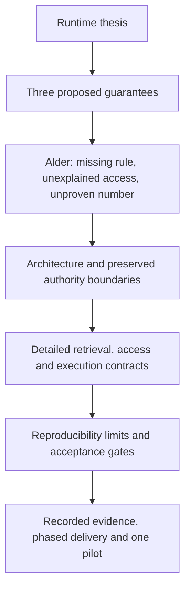

# Plan — full RFC implementation handoff

## Goal Capsule

- **Objective:** Readers can retell the Alder failure and explain the proposed retrieval, access and execution contracts, including their limits and evidence status.
- **Means:** Apply the [content map](full-update-content-map.md) and [draft copy](full-update-DRAFT.md) throughout the main RFC (KTD1).
- **Authority:** Haiyuan's locked framing and [intent](full-update-intent.md), then [spec R1–R16](full-update-spec.md), govern this slice. Existing main-RFC core contracts remain authoritative where the spec says preserve them.
- **Execution:** Astra authors and pushes these five artifacts. Fable implements `rfc/index.html` afterward on `feat/rfc-full-update` and owns implementation validation and PR creation/update. No main HTML rewrite, PR creation or merge in Astra's pass.
- **Stop condition:** The artifacts are sufficient to implement and review every mapped section without inventing product scope. Runtime builds, GCP mutations and new recorded sessions are not part of this document task.

---

## Product Contract

### Summary

Make the full RFC explain BigQuery as the proposed runtime for replayable OKF context, explainable access and verifiable execution. Use Alder as the motivating illustration while retaining Germany's existing fixture and evidence role.

### Problem Frame

The short brief carries the latest story and three comparisons. The main RFC still opens with older projection language and scopes determinism mainly to compilation; its deeper text needs to match the updated promise without overstating implementation.

### Requirements

The canonical requirements are [R1–R16 and AE1–AE8 in the spec](full-update-spec.md). R1–R5 own narrative/scope, R6–R12 own proposed contracts, and R13–R16 own honesty and presentation. Product Contract preserved from the user brief; the proposed retrieval detail makes its “same inputs” qualification explicit.

### Scope

Modify main `rfc/index.html` and, if implementation reveals a needed clarification, these new `full-update-*` artifacts. Keep old demo and KC-alignment slice docs, board-pack, its redirect, full-demo and fixture/capture files unchanged. Existing numeric Phase 0–5 gates remain future runtime work; adding acceptance text does not execute those gates.

---

## Planning Contract

### Key Technical Decisions

- KTD1. **Update every mapped section in place.** Preserve public anchors and the full design depth. Move long baseline history out of the masthead so the opening communicates the customer/runtime argument. Governs R1–R5, R14–R16.
- KTD2. **Alder motivates; Germany remains the fixture.** (session-settled: user-directed — chosen over replacing the concrete story with thesis cards: the customer moment must remain retellable.) No fixture hashes or captured sessions change. Governs R3–R4, R13.
- KTD3. **Controlled retrieval is a qualified contract, not a blanket rerun guarantee.** Keep free discovery, deterministic selection and retained-envelope reconstruction separate. Preserve ID/hash protocols; add proposed retrieval inputs to the governed manifest description, with serialization/version details gated before runtime implementation. Governs R6–R8, R11–R12.
- KTD4. **Current policy gates retrieval.** Preserve the v1 security-domain and caller-delegated stance. Authenticated requester bindings and privileged access records are proposed integration, not native per-node Graph IAM. Governs R9–R10.
- KTD5. **Keep retrieval and computation evidence distinct.** “Retrieval receipt” names the governed selection record; it does not expand the public `context_ref` or imply `ATTESTED`. Execution claims retain the existing independent-attester contract. Governs R11–R13.
- KTD6. **Use a bounded source refresh.** Preserve the dated source audit, replace stale LookupContext uncertainty with scoped local capture evidence, and avoid stale generic Graph feature-status claims. Do not reinterpret sample DDL/seed rows as implemented runtime features. Governs R12–R14.

### Assumptions and deferred details

The existing light main-RFC visual design remains suitable; a local comparison layout and a modest callout are sufficient. This is a full-document content update, not a redesign of the whole site. Retain substantive protocol detail rather than pursuing a new fixed word limit.

The profile's future implementation must finalize a versioned retrieval-manifest serialization, exact least-privilege policy-resolver grants, benchmarks and optional Graph compatibility. Those are phase-owned runtime decisions, not blockers for the HTML update. Do not silently change `okf-context/1`, identifier formulas, public fields or phase-completion status in the document implementation.

### Reader and contract flow

This is the reader flow. Inside the architecture, authorization must precede disclosure and constrain every retrieval hop; the numbered benefit order is not a permissive execution order.

---

## Implementation Units

### U1. Rewrite the opening and motivation

**Goal:** Establish the customer/runtime argument before the long design.

**Requirements:** R1–R5, R13–R15. **Dependencies:** None. **Files:** `rfc/index.html`.

**Approach:** Apply B01–B04. Thin the service-role strip, add one comparison, place Alder's compact story/arithmetic in motivation, and move baseline history to its mapped disclosure. Follow KTD1–KTD2 and existing `.wrap`, `.note`, `.credo` and heading patterns.

**Verification scenarios:** A first skim finds all three outcomes, Alder's numbers/stakes and a proposed label; the board-pack link resolves; the text does not identify Alder as a real capture or replace Germany's fixture role. No new automated tests are needed for this static copy change.

### U2. Align architecture and detailed contracts

**Goal:** Make the proposed mechanisms actually support the opening claims.

**Requirements:** R6–R12. **Dependencies:** U1. **Files:** `rfc/index.html`.

**Approach:** Apply B05–B11 and the exact terminology map. Update existing diagram labels/text equivalents and the relevant disclosures. Keep all identity, ownership, privacy and attestation invariants in the spec's preservation table. Avoid a second small story diagram beside the existing full system design.

**Verification scenarios:** Trace AE1–AE5 and AE7 from comparison to detailed contract. A pinned publication cannot restore revoked access; a graph walk cannot validate substituted SQL; a job ID cannot imply attestation. The random envelope ID, keyed digests and unchanged `context_ref` remain consistent. Source-diff review is the proof here, not simulated runtime tests.

### U3. Connect acceptance, phases and evidence

**Goal:** Tell maintainers what must be built and what the site already demonstrates.

**Requirements:** R4–R14. **Dependencies:** U2. **Files:** `rfc/index.html`.

**Approach:** Apply B12–B14. Extend both phase summary rows and detailed gates, preserve the Germany baseline, add the scoped evidence box, and close with a Finance pilot. Keep historical phase assertions dated and qualified.

**Verification scenarios:** AE6 and AE8 have explicit limits. All three guarantees reach phase gates. Each recorded claim links to supporting evidence; seeded rows, sample Catalog pushes and operator SELECT jobs are not described as governed sync or attested metric execution. `BQ_COMMITTED` and `ATTESTED` appear only as scoped proposed protocol terms or qualified specimens.

### U4. Verify the complete reading experience

**Goal:** Deliver coherent, usable HTML without changing companion pages.

**Requirements:** R1, R13–R16. **Dependencies:** U1–U3. **Files:** `rfc/index.html`; clarify `rfc/full-update-*` only if necessary.

**Approach:** Review the final page against every content-map row, then inspect responsive and print rendering. Preserve source links and existing anchors. Remove displaced duplicate prose and unused styles introduced by this update.

**Verification scenarios:** At 1280/900/768/375/320, comparison headers remain associated with their cells and the document does not overflow. Keyboard opens native disclosures with visible focus. Diagrams have usable text equivalents. Closed-state print includes any newly folded content; report which engines were checked. No new JS, fixture changes or companion-page edits occur.

---

## Verification Contract

| Check | Applies to | Passing evidence |
| --- | --- | --- |
| Section/content coverage | U1–U3 | Every content-map row resolved; B01–B14 placed or meaningfully integrated, not appended as a second essay |
| Contract consistency | U2–U3 | R6–R12 and AE1–AE8 can be read without contradictions across prose, diagrams, ladder and phase tables |
| Claim audit | U1–U3 | Proposed vs observed vs illustrative language is local to the claim; local capture links resolve |
| Source integrity | U4 | `git diff --check` passes; old docs, demo/full-demo, board-pack and redirect show no diff |
| Links and semantics | U4 | Unique IDs; all local hrefs/fragments resolve; no stale brief href or audience label |
| Browser and print | U4 | Requested widths inspected, keyboard focus/toggles work, no document overflow, print readable; named-engine results recorded |

No runtime conformance suite or new test suite is warranted for this documentation slice. The checks above validate the document; numeric Phase 0–5 runtime gates remain explicitly unexecuted by this work.

---

## Definition of Done

For Astra's pass: all five artifacts exist, references and coverage are checked, only artifacts are committed/pushed on the requested branch, and the session record has status `astra_cowrite_done`. No PR is opened.

For Fable's subsequent pass: U1–U4 are implemented and verified; the RFC presents one consistent argument; prior contracts and companion artifacts are preserved; there is no abandoned or duplicate layout/copy; the PR describes the final document change and actual checks. Fable owns PR creation/update. Merge remains outside this handoff.

---

## Sources and Research

- `rfc/index.html` at `b2b3c90`: main contract and section structure. Its styles are inline, not `rfc/styles.css`.
- `rfc/board-pack/STORY.md`, `spec.md`, `index.html`: locked story, comparisons, arithmetic and limits.
- `rfc/kc-align-spec.md`: separate `okf-context-runtime` aspect. Older alignment intent/plan wording about adding pin fields to `okf` is historical and must not be copied.
- `rfc/full-demo/README.md`, `spec.md`, `ARCHITECTURE.md`, `live/README.md`: recorded/proposed boundary. Exact evidence paths are listed with B07/B14.
- [Knowledge Catalog custom sources](https://docs.cloud.google.com/dataplex/docs/ingest-custom-sources) and [IAM permissions](https://docs.cloud.google.com/dataplex/docs/iam-permissions), checked 2026-09-05: custom-entry grouping and distinct source/entry/aspect checks support scoped IAM wording, not a universal EntryGroup-only claim.
- [BigQuery query syntax](https://docs.cloud.google.com/bigquery/docs/reference/standard-sql/query-syntax), checked 2026-09-05: result ordering requires explicit ordering; the retrieval proposal supplies its own stable selection/tie-breaking contract.
- [BigQuery Graph overview](https://docs.cloud.google.com/bigquery/docs/graph-overview), checked 2026-09-05: documents table/view inputs. This supports replacing the old generic views uncertainty, not claiming this OKF projection is implemented or has passed its compatibility gate.

The external check is limited to these claim boundaries. It is not a new exhaustive audit of the upstream repositories, permissions probes or runtime performance.
